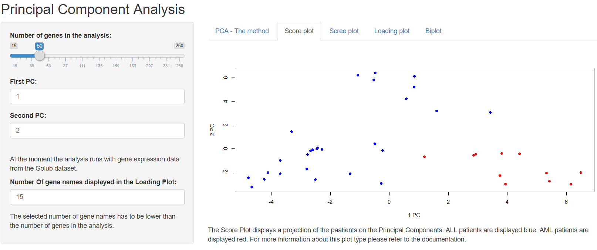
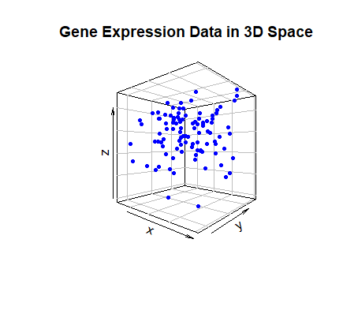
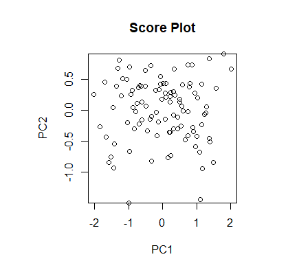
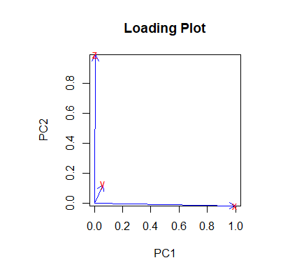
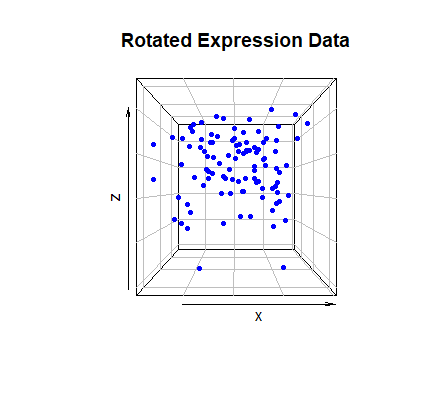
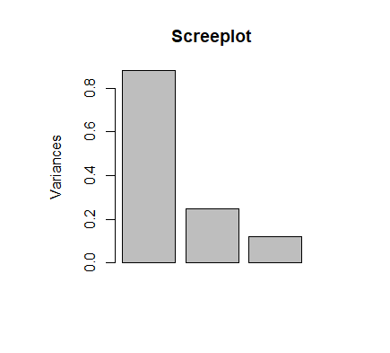
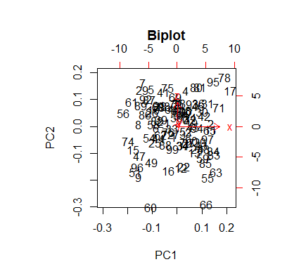

#  The PCA App

The PCA app performs a Principal Component Analysis (PCA) on the Golub dataset of leukemia patients. PCA is a tool for dimension reduction of multi dimensional data. In the input panel on the left side the number of genes in the analysis and the wanted Principal Components can be selected. It is also possible to change the maximum amount of gene names displayed in the Loading plot. The displayed Genes then are the ones with the highest variance. In the main panel on the right side the user can select the plot type and can get some basic information about the analysis. For more information about the plot types please review the explanation below. 

## The Golub Data

The Golub data by Todd Golub covers the Gene Expression of 27 Patients with acute lymphoblastic leukemia (ALL) and 11 patients with acute myeloid leukemia (AML). In total there were 7129 Genes measured. 
The App performs a PCA to find difference in the gene expression between these two group of patients. 

## Installation
The PCA App can be used locally on your computer after downloading the source code. 
A full Zip Download of all resources is possible by using the green *Clone or Downlaod* Button in the top right corner. 

These R Packages ***need to be installed*** for the package to work:
* [BiocManager](https://www.bioconductor.org/install/)
* [GolubEsets](https://bioconductor.org/packages/release/data/experiment/html/golubEsets.html)
* [shiny](https://shiny.rstudio.com/)
* For recalculationg the explaining plots: [plot3D](http://www.sthda.com/english/wiki/impressive-package-for-3d-and-4d-graph-r-software-and-data-visualization)

To start the app open your R console and change the folder to the downloaded file, then use this code to execute the source code: 

<code> 
library(shiny)  
runApp("app.R")
</code>
 
The testing has been done with R 3.6.1 with R Studio 1.2.5001 on Windows 10. 

## What is Principal Component Analysis?

The gene expression of organisms is a very complex system. Changes in the conditions result in changes of a variety of genes correlated positive or negative. Therefore, a lot of information gain is made by looking at several genes at the same time. 
While the gene expression of cells depends of thousands of genes (***multidimensional data***) only up to three dimensions of the data could be visualised at the same time. 

In this case we will use the dimension reduction method Principal Component analysis to reduce the amount of dimensions of the data while keeping the maximum amount of information. 

### A three dimensional approach

For explaining the idea of dimension reduction with PCA we will first focus on visualising three dimensional data in two dimensions and will increase the amount of dimensions afterwards. For a visual explanation we have a look at the randomly generated expression data of 3 genes x, y and z from 100 Patients. We can visualise this data in three dimensions. One point in the plot represents one of the patients. 

But how is the difference in the expression? Can we group the Patients into different Groups? How can we see a difference in the expression? 

To answer these questions we can have a look from different sides on the data, imagine turning the plot in 3D space and taking pictures from different views. Which picture has the best angle to group the patients or tell about a difference in the gene expression? 
Here the Principal Components Analysis can compute this "view" on the data for us. 
With the given data the method tries to find an axis trough the three dimensional data with the maximal possible variance, this axis is called "Principal Component 1 (PC1)". 

Orthogonal to that axis it constructs another Principal Component maximising the rest of the variance. With three dimensional data we can get a maximum of three new Principal Components who are a new orthogonal Coordinate System to have a look at the data. As defined along PC1 the data shows the biggest variance, along PC2 the second biggest etc. To have the "best" view on the Data we have to Plot PC1 against PC2. 

In this ***Score Plot*** we can se a projection of the original Data on the Plane made up by the two first principal components. Now we can work with a plot with reduced dimension (only 2) and can be shure that the new coordinate System covers the most variance possible. 

But how exactly do the Principal Components look like? As said before in this three dimensional case the principal components are a straigth line trough the Data. Therefore the Principal Components are a linear combination of the original variablen (here: Genes). 

In the result of the PCA the coefficients of the Principal Components are called Loadings and can be visualised in a ***Loading Plot***. In the following Loading Plot the actual composition of the first two PCs are visualized. 

As we can see PC1 is made up mainly by the original gene x while PC 2 is mainly characterized by Gene z. In the first Principal Components gene y seems not to explain a lot of the found variance. 

Because we are working with three dimensional Data we can still have a look into the original Data. This time we rotate the Plot to have a look in the x/z direction as directed from the PCA. 

When we take a look back on the Score Plot we can clearly see that this is nearly the view which was calculated by the PCA, however the exact view consists in a small rotation in the y axis which can be seen in the Loading Plot. Also this view still has the three dimensional perspective while the Score plot is projected on the plane described by the Principal Components. 

### Multi Dimensional Data
In our three Dimensional example the "best view" can clearly also be found with rotating the original Data, but with multidimensional data this is, due to the impossible visualisation, unpractial. The Principal Components can still be computed an visualised. The main part of the variance can be explained by more than 2 PCs. But on how many PCs to we have to look at? 

The following ***Scree Plot*** shows the variance for each Principal Component. By a look at this Plot we have a visual indicator at how many Principal Components we have to look.  

Often the results of a PCA get visualized with a ***Biplot*** which is a combination of the shown Score and Loading Plots. 

 

The source code which was used for generating the explaining plots is available in the file PCA_example.R . The randomly generated three Dimensional data is also available for recalculations in the file PCA_test_data.txt.

## Used Functions

* data("Golub_Train""), exprs(Golub_Train): Loading the data from the dataset
* replace (): Removing unwanted data
* log2(): 
* rownames(): changing the rownames to the leukemia type of the patient
* fluidPage(): UI definition
* titlePanel(): title setup of the App
* sidebarLayout(): sidebar UI
* sidbarPanel(): initialising the Input Panel on the left side
* manPanel(): initialising the main Panel with the plots
* sliderInput(), numericInput(): getting User intput
* tabsetpanel(), tabPanel(): initializing the Panel setup of the plots
* recalcPCA(): recalculation of the PCA when the number of Genes is changed
* sort(): sorting the data
* prcomp(): the Principal Component Analysis
* server (), renderPlot(), renderText(): rendering dynamic Outputs
* plot(), points(), arrows(), text(): Functions for creating the PCA Plots

## The results

The Principal Component Analysis can reveal how exactly the patients vary in their expression. The Score Plot is a good start to see if there is a significant difference. For understanding this difference the Loading plot shows the genes which construct the view seen in the Score plot. Strongly correlated genes are expressed with very close arrows. The displayed gene names can be used to get more information about the genes in databases. 

## Further Information
For further information about Principal Component Analysis please have a look at these resouces: 
* [Youtube: PCA - main ideas in 5 Minutes](https://youtu.be/HMOI_lkzW08)
* [Youtube: PCA - step by step](https://youtu.be/FgakZw6K1QQ)
* [Wikipedia_ Principal Component Analysis](https://en.wikipedia.org/wiki/Principal_component_analysis)

